# DATA_MODEL.md — ERP STEFFEN

## 1. Objetivo

Este documento traduce `PROJECT.md` y `BUSINESS_RULES.md` a un modelo de datos relacional.

La prioridad del modelo es:

1. evitar duplicación de lógica;
2. conservar trazabilidad;
3. impedir que operaciones históricas se recalculen;
4. separar datos maestros, estados actuales e históricos;
5. permitir crecimiento sin reestructurar las entidades centrales;
6. mantener Stock, Fábrica y Patrimonio como historiales relacionados pero independientes.

Este documento define estructura de datos.  
No redefine reglas de negocio.

Ante contradicción:

`BUSINESS_RULES.md` tiene prioridad.

---

# 2. Convenciones técnicas globales

## 2.1 Claves primarias

Todas las entidades persistentes utilizan:

`id UUID PRIMARY KEY`

El código visible (`PRO0001`, `CMP0001`, etc.) nunca es una clave primaria ni una clave foránea.

---

## 2.2 Códigos visibles

Los códigos visibles se generan mediante una secuencia transaccional por prefijo.

Formato:

`PPP0001`

Cuatro dígitos son el mínimo visual, no un límite.

Ejemplos:

- `PRO0001`
- `PRO9999`
- `PRO10000`

Los códigos nunca se reutilizan aunque una operación sea cancelada.

---

## 2.3 Fechas

Se distinguen dos conceptos:

### `business_date`

Fecha funcional de la operación.

Puede ser modificada por el usuario cuando registra una operación correspondiente a un día anterior.

Tipo:

`DATE`

### `created_at`

Momento técnico real de creación del registro.

Tipo:

`TIMESTAMPTZ`

### `updated_at`

Momento técnico de última edición.

Tipo:

`TIMESTAMPTZ`

---

## 2.4 Peso

Tipo:

`NUMERIC(12,3)`

Unidad única:

`kg`

Resolución:

`0,001 kg`

No existen conversiones internas a gramos.

---

## 2.5 Cantidades por unidad

Para PRO y COM, el stock físico se expresa en unidades enteras.

Para MPR se expresa en kg con tres decimales.

Cuando se use una tabla genérica de stock:

`quantity NUMERIC(20,3)`

Regla:

- MPR → admite tres decimales;
- COM → debe ser entero;
- PRO → debe ser entero.

---

## 2.6 Dinero

Para cálculos internos:

`NUMERIC(20,6)`

No utilizar `FLOAT` ni `DOUBLE`.

Los costos deben conservar precisión interna.

Las Listas de Precios utilizan pesos enteros:

`NUMERIC(20,0)`

---

## 2.7 Porcentajes

Tipo:

`NUMERIC(7,4)`

Los porcentajes se almacenan como porcentaje visible.

Ejemplo:

`30.0000` significa 30%.

---

## 2.8 Monedas

Valores iniciales:

- `ARS`
- `USD`

Tipo:

`VARCHAR` + restricción o tabla catálogo.

No usar valores monetarios sin moneda cuando el dato pueda existir en moneda origen.

---

## 2.9 Borrado

Los datos históricos no se eliminan físicamente.

Para maestros:

`active BOOLEAN`

Para operaciones:

usar estados.

Un PED borrado desde UI puede conservarse internamente como cancelado para trazabilidad técnica, pero:

- no participa en planificación;
- no genera movimientos;
- no aparece en Pedidos abiertos.

---

# 3. Arquitectura de fuentes de verdad

## 3.1 Stock

Fuente histórica:

`stock_movements`

Estado actual:

`stock_balances`

`stock_balances` se actualiza únicamente dentro de la misma transacción que crea/modifica el movimiento correspondiente.

Nunca se modifica stock directamente desde una pantalla.

Todo cambio de stock debe provenir de:

- Compra;
- Fabricación;
- Envasado;
- Venta;
- Ajuste;
- Stock inicial.

---

## 3.2 Patrimonio

Fuente histórica:

`patrimonial_movements` + `financial_entries`

Estado actual:

`financial_accounts.current_balance`

El saldo de una cuenta se actualiza únicamente mediante `financial_entries`.

Nunca se modifica Caja o una cuenta corriente directamente.

---

## 3.3 Fábrica

Fuente histórica:

`factory_movements`

El estado físico del granel vive en:

`bulk_lots.kg_available`

Toda modificación del granel debe provenir de una operación de fabricación/envasado/cierre de lote.

---

# 4. Tabla `code_sequences`

Responsable de generar códigos visibles sin `MAX + 1`.

Campos:

| Campo | Tipo | Regla |
|---|---|---|
| `prefix` | VARCHAR(3) PK | COM, MPR, PBA, PRO, etc. |
| `last_value` | BIGINT | >= 0 |
| `updated_at` | TIMESTAMPTZ | automático |

Generación:

1. bloquear fila del prefijo;
2. incrementar `last_value`;
3. persistir;
4. formar código con `LPAD(..., 4, '0')`;
5. confirmar junto con la operación.

---

# 5. Tabla `business_operations`

## Fuente única de fecha funcional

Para operaciones que generan movimientos, `business_operations.business_date` es la única fuente de verdad de la fecha funcional.

`MST`, `MFA` y `MOV` no duplican `business_date`; la obtienen mediante su `operation_id`.

Esto evita inconsistencias cuando se corrige la fecha de una Compra o Pago editable.

Entidad técnica común para operaciones que pueden generar movimientos.

No tiene código visible.

Campos:

| Campo | Tipo | Regla |
|---|---|---|
| `id` | UUID PK | |
| `operation_type` | VARCHAR | tipo de operación |
| `business_date` | DATE | |
| `created_at` | TIMESTAMPTZ | |
| `updated_at` | TIMESTAMPTZ | |

Tipos iniciales:

- `BULK_PRODUCTION`
- `PACKAGING`
- `PURCHASE`
- `SALE_RTO`
- `SALE_RTM`
- `CUSTOMER_PAYMENT`
- `SUPPLIER_PAYMENT`
- `OPERATING_EXPENSE`
- `WITHDRAWAL`
- `MARKETPLACE_SETTLEMENT`
- `STOCK_ADJUSTMENT`

Objetivo:

permitir que `MST`, `MFA` y `MOV` apunten a una misma operación origen sin depender de códigos visibles.

---

# 6. Tabla `exchange_rates`

Historial de cotización global.

Campos:

| Campo | Tipo | Regla |
|---|---|---|
| `id` | UUID PK | |
| `currency_code` | VARCHAR | inicialmente USD |
| `rate_to_ars` | NUMERIC(20,6) | > 0 |
| `effective_at` | TIMESTAMPTZ | |
| `is_current` | BOOLEAN | una vigente por moneda |
| `created_at` | TIMESTAMPTZ | |

Restricción:

solo una fila `is_current = true` por moneda.

Actualizar cotización:

- no sobrescribe la fila anterior;
- crea nueva fila;
- desactiva la anterior;
- no modifica históricos.

---

# 7. Tabla `customers`

Maestro de clientes registrados.

Campos:

| Campo | Tipo |
|---|---|
| `id` | UUID PK |
| `code` | VARCHAR UNIQUE |
| `created_date` | DATE |
| `name` | VARCHAR |
| `dni` | VARCHAR NULL |
| `address` | VARCHAR NULL |
| `locality` | VARCHAR NULL |
| `province` | VARCHAR NULL |
| `phone` | VARCHAR NULL |
| `transport_name` | VARCHAR NULL |
| `transport_address` | VARCHAR NULL |
| `category` | VARCHAR NULL |
| `discount_1_pct` | NUMERIC(7,4) NULL |
| `discount_2_pct` | NUMERIC(7,4) NULL |
| `discount_3_pct` | NUMERIC(7,4) NULL |
| `active` | BOOLEAN |
| `created_at` | TIMESTAMPTZ |
| `updated_at` | TIMESTAMPTZ |

Código:

`CLIxxxx`

Orden del menú Cuentas Clientes:

`updated_at DESC`

Los descuentos deben cumplir:

`0 <= descuento <= 100`

---

# 8. Tabla `suppliers`

Maestro de proveedores.

Campos:

| Campo | Tipo |
|---|---|
| `id` | UUID PK |
| `code` | VARCHAR UNIQUE |
| `created_date` | DATE |
| `name` | VARCHAR |
| `salesperson` | VARCHAR NULL |
| `phone` | VARCHAR NULL |
| `currency_code` | VARCHAR |
| `active` | BOOLEAN |
| `created_at` | TIMESTAMPTZ |
| `updated_at` | TIMESTAMPTZ |

Código:

`PRVxxxx`

Regla monetaria:

un proveedor trabaja en una sola moneda.

`currency_code` es obligatorio al crear el Proveedor y admite:

- ARS;
- USD.

Una vez creado el Proveedor, `currency_code` es **inmutable**.

Todas sus relaciones comerciales y CMP heredan esa moneda.

La aplicación/backend debe impedir:

- modificar `currency_code` de un PRV existente;
- registrar una CMP con una moneda distinta;
- mezclar monedas dentro de una CMP.

---

# 9. Tabla `stock_items`

Superentidad para todo objeto con stock.

Tipos:

- MPR;
- COM;
- PRO.

Campos:

| Campo | Tipo | Regla |
|---|---|---|
| `id` | UUID PK | |
| `code` | VARCHAR UNIQUE | prefijo según tipo |
| `item_type` | VARCHAR | MPR / COM / PRO |
| `name` | VARCHAR | |
| `unit_type` | VARCHAR | KG / UNIT |
| `stock_minimum` | NUMERIC(20,3) | > 0 |
| `active` | BOOLEAN | |
| `created_date` | DATE | |
| `created_at` | TIMESTAMPTZ | |
| `updated_at` | TIMESTAMPTZ | |

Restricciones:

- MPR → `unit_type = KG`
- COM → `unit_type = UNIT`
- PRO → `unit_type = UNIT`
- `stock_minimum > 0`

Esta tabla permite que `MST` y `stock_balances` utilicen una única FK.

---

# 10. Tabla `raw_materials`

Subtipo MPR.

Campos:

| Campo | Tipo |
|---|---|
| `stock_item_id` | UUID PK/FK stock_items |
| `inci` | VARCHAR NULL |

Debe corresponder a:

`stock_items.item_type = MPR`

---

# 11. Tabla `components`

Subtipo COM.

Campos:

| Campo | Tipo |
|---|---|
| `stock_item_id` | UUID PK/FK stock_items |

Debe corresponder a:

`stock_items.item_type = COM`

---

# 12. Tabla `base_products`

Productos Base.

Campos:

| Campo | Tipo |
|---|---|
| `id` | UUID PK |
| `code` | VARCHAR UNIQUE |
| `name` | VARCHAR |
| `active` | BOOLEAN |
| `created_date` | DATE |
| `created_at` | TIMESTAMPTZ |
| `updated_at` | TIMESTAMPTZ |

Código:

`PBAxxxx`

Un PBA existe desde que se crea su primera fórmula.

---

# 13. Tabla `products`

Subtipo PRO.

Campos:

| Campo | Tipo | Regla |
|---|---|---|
| `stock_item_id` | UUID PK/FK stock_items | |
| `base_product_id` | UUID FK base_products | |
| `presentation` | VARCHAR | comercial |
| `weight_kg` | NUMERIC(12,3) | > 0 |
| `extra_variable_pct` | NUMERIC(7,4) | fijo en 2 para el MVP |
| `created_at` | TIMESTAMPTZ | |

Debe corresponder a:

`stock_items.item_type = PRO`

`presentation` no interviene en cálculos de peso.

Restricción MVP:

`extra_variable_pct = 2`

No es editable desde UI.

---

# 14. Tabla `product_components`

Composición de Componentes de cada PRO.

Campos:

| Campo | Tipo |
|---|---|
| `product_id` | UUID FK products |
| `component_id` | UUID FK components |
| `quantity_per_unit` | INTEGER |
| `sort_order` | INTEGER |

Restricción UNIQUE:

`(product_id, component_id)`

Restricciones:

- `quantity_per_unit > 0`

El PBA no se guarda aquí.

---

# 15. Tabla `formula_versions`

Versiones de fórmula de un PBA.

Campos:

| Campo | Tipo |
|---|---|
| `id` | UUID PK |
| `base_product_id` | UUID FK |
| `version_number` | INTEGER |
| `business_date` | DATE |
| `observations` | TEXT NULL |
| `is_current` | BOOLEAN |
| `created_at` | TIMESTAMPTZ |

Restricciones:

- unique `(base_product_id, version_number)`
- una sola versión `is_current = true` por PBA.

Editar fórmula:

- no modifica una versión anterior;
- crea una versión nueva;
- desactiva como actual la anterior.

---

# 16. Tabla `formula_version_items`

Materias Primas de una versión de fórmula.

Campos:

| Campo | Tipo |
|---|---|
| `id` | UUID PK |
| `formula_version_id` | UUID FK |
| `raw_material_id` | UUID FK raw_materials |
| `quantity_kg` | NUMERIC(12,3) |
| `sort_order` | INTEGER |

Restricciones:

- `quantity_kg > 0`
- UNIQUE `(formula_version_id, raw_material_id)`

Una misma MPR no debe repetirse en dos filas de la misma versión; si se necesita mayor cantidad, se consolida en una sola fila.

No guardar como fuente de verdad:

- costo por kg actual;
- costo final actual.

Esos valores se calculan usando el motor de costo vigente.

---

# 17. Tabla `supplier_items`

Relación muchos-a-muchos:

`Proveedor ↔ MPR/COM`

Campos:

| Campo | Tipo | Regla |
|---|---|---|
| `id` | UUID PK | |
| `supplier_id` | UUID FK suppliers | |
| `stock_item_id` | UUID FK stock_items | solo MPR/COM |
| `quoted_unit_price_net` | NUMERIC(20,6) | > 0 |
| `price_updated_at` | TIMESTAMPTZ | obligatorio |
| `active` | BOOLEAN | |
| `created_at` | TIMESTAMPTZ | |
| `updated_at` | TIMESTAMPTZ | |

Unique:

`(supplier_id, stock_item_id)`

El precio de esta relación:

- es precio neto;
- está expresado en la moneda del proveedor;
- puede editarse desde la ficha del proveedor;
- se actualiza al registrar/editar una Compra de ese ítem con ese proveedor.

`price_updated_at` representa el momento real en que el precio de esa relación fue actualizado.

Crear un nuevo ítem con proveedor/precio inicial constituye la primera actualización de precio.

Si una CMP utiliza una MPR/COM existente que aún no está asociada al proveedor:

- crear automáticamente `supplier_items`;
- utilizar el precio de la línea de Compra;
- establecer `price_updated_at` al momento del registro.

---

# 18. Motor de costo actual de MPR/COM

No requiere una tabla duplicada de “costo actual”.

Debe existir una consulta/servicio único.

Algoritmo:

1. localizar todas las relaciones `supplier_items` activas del ítem;
2. elegir la de mayor `price_updated_at`;
3. tomar:
   - moneda del proveedor;
   - `quoted_unit_price_net`;
4. si ARS:
   - conversión = 1;
5. si USD:
   - utilizar cotización global vigente;
6. aplicar IVA 21%.

Fórmula:

`Costo actual bruto ARS = precio neto proveedor × conversión actual × 1,21`

La **Fecha de compra no interviene en la selección de la fuente del costo actual**.

Una Compra o una edición manual de precio puede convertir a un proveedor en la nueva fuente de costo al actualizar `price_updated_at`.

Todos los costos teóricos oficiales son **con IVA incluido**.

---

# 19. Tabla `stock_balances`

Saldo actual rápido.

Campos:

| Campo | Tipo |
|---|---|
| `stock_item_id` | UUID PK/FK |
| `quantity` | NUMERIC(20,3) |
| `updated_at` | TIMESTAMPTZ |

Nunca se modifica de forma aislada.

Toda modificación debe estar respaldada por un `MST`.

Restricción por tipo:

- MPR (`KG`) → admite hasta 3 decimales;
- COM/PRO (`UNIT`) → `quantity` debe ser un número entero.

---

# 20. Tabla `stock_movements`

Ledger de stock.

Campos:

| Campo | Tipo |
|---|---|
| `id` | UUID PK |
| `code` | VARCHAR UNIQUE |
| `operation_id` | UUID FK business_operations |
| `stock_item_id` | UUID FK stock_items |
| `movement_type` | VARCHAR |
| `quantity_delta` | NUMERIC(20,3) |
| `description` | TEXT |
| `created_at` | TIMESTAMPTZ |

La fecha funcional se obtiene desde `business_operations.business_date`.

Código:

`MSTxxxx`

Tipos:

- VENTA
- COMPRA
- ENVASADO
- FABRICACIÓN
- AJUSTE

Signo:

- entrada → positivo;
- salida → negativo.

Restricción por unidad:

- MPR → hasta 3 decimales;
- COM/PRO → `quantity_delta` entero.

El saldo histórico se reconstruye desde los movimientos; `stock_balances` conserva únicamente el saldo actual.

---

# 21. Stock inicial

Crear PRO/MPR/COM con stock inicial mayor a cero debe generar:

- operación `STOCK_ADJUSTMENT`;
- `MST` tipo AJUSTE;
- descripción `Stock inicial`.

No insertar stock directamente en `stock_balances`.

Cuando un ítem se crea dentro de una CMP:

- el maestro se crea sin duplicar la entrada física;
- el stock ingresa exclusivamente mediante la CMP.

---

# 22. Tabla `stock_adjustments`

Cabecera de ajustes.

Campos:

| Campo | Tipo |
|---|---|
| `id` | UUID PK |
| `operation_id` | UUID UNIQUE/FK |
| `reason` | TEXT |
| `created_at` | TIMESTAMPTZ |

---

# 23. Tabla `stock_adjustment_items`

Campos:

| Campo | Tipo |
|---|---|
| `id` | UUID PK |
| `adjustment_id` | UUID FK |
| `stock_item_id` | UUID FK |
| `quantity_delta` | NUMERIC(20,3) |
| `reason` | TEXT |

`quantity_delta != 0`

Para COM/PRO, `quantity_delta` debe ser entero.

Genera un MST por línea.

---

# 24. Tabla `bulk_lots`

Lotes físicos GRA.

Campos:

| Campo | Tipo |
|---|---|
| `id` | UUID PK |
| `code` | VARCHAR UNIQUE |
| `operation_id` | UUID UNIQUE/FK |
| `base_product_id` | UUID FK |
| `formula_version_id` | UUID FK |
| `kg_fabricated` | NUMERIC(12,3) |
| `kg_available` | NUMERIC(12,3) |
| `status` | VARCHAR |
| `observations` | TEXT NULL |
| `total_cost_snapshot_ars` | NUMERIC(20,6) |
| `cost_per_kg_snapshot_ars` | NUMERIC(20,6) |
| `closed_at` | TIMESTAMPTZ NULL |
| `created_at` | TIMESTAMPTZ |

Código:

`GRAxxxx`

Estados:

- OPEN
- CLOSED

Al crear:

`kg_available = kg_fabricated`

---

# 25. Tabla `bulk_lot_material_snapshots`

Snapshot de cada MPR realmente utilizada para fabricar un GRA.

Campos:

| Campo | Tipo |
|---|---|
| `id` | UUID PK |
| `bulk_lot_id` | UUID FK |
| `raw_material_id` | UUID FK |
| `quantity_kg` | NUMERIC(12,3) |
| `source_supplier_id` | UUID FK suppliers NULL |
| `source_currency` | VARCHAR |
| `source_unit_price_net` | NUMERIC(20,6) |
| `fx_rate_snapshot` | NUMERIC(20,6) NULL |
| `vat_rate_pct` | NUMERIC(7,4) |
| `unit_cost_gross_ars_snapshot` | NUMERIC(20,6) |
| `total_cost_ars_snapshot` | NUMERIC(20,6) |

Este snapshot impide recalcular una fabricación histórica.

---

# 26. Tabla `packaging_operations`

Operaciones ENV.

Campos:

| Campo | Tipo |
|---|---|
| `id` | UUID PK |
| `code` | VARCHAR UNIQUE |
| `operation_id` | UUID UNIQUE/FK |
| `bulk_lot_id` | UUID FK |
| `product_id` | UUID FK products |
| `units_packaged` | INTEGER |
| `kg_available_before` | NUMERIC(12,3) |
| `kg_consumed` | NUMERIC(12,3) |
| `is_last_of_lot` | BOOLEAN |
| `variance_type` | VARCHAR |
| `variance_kg` | NUMERIC(12,3) |
| `base_cost_per_kg_snapshot_ars` | NUMERIC(20,6) |
| `unit_cost_snapshot_ars` | NUMERIC(20,6) |
| `total_cost_snapshot_ars` | NUMERIC(20,6) |
| `observations` | TEXT NULL |
| `created_at` | TIMESTAMPTZ |

Código:

`ENVxxxx`

`units_packaged > 0`

`kg_consumed = units_packaged × product.weight_kg`

`variance_type`:

- NONE
- MERMA
- SOBRANTE

Si no es último lote:

`kg_consumed <= kg_available_before`

Si es último lote:

puede existir diferencia.

Al cerrar:

`bulk_lots.kg_available = 0`

---

# 27. Tabla `packaging_component_snapshots`

Snapshot de componentes consumidos y sus costos.

Campos:

| Campo | Tipo |
|---|---|
| `id` | UUID PK |
| `packaging_operation_id` | UUID FK |
| `component_id` | UUID FK |
| `quantity_per_unit` | INTEGER |
| `quantity_total` | INTEGER |
| `unit_cost_gross_ars_snapshot` | NUMERIC(20,6) |
| `total_cost_ars_snapshot` | NUMERIC(20,6) |

---

# 28. Tabla `factory_movements`

Historial MFA.

Campos:

| Campo | Tipo |
|---|---|
| `id` | UUID PK |
| `code` | VARCHAR UNIQUE |
| `operation_id` | UUID FK |
| `movement_type` | VARCHAR |
| `base_product_id` | UUID FK NULL |
| `bulk_lot_id` | UUID FK NULL |
| `quantity_kg` | NUMERIC(12,3) NULL |
| `description` | TEXT |
| `created_at` | TIMESTAMPTZ |

La fecha funcional se obtiene desde `business_operations.business_date`.

Código:

`MFAxxxx`

Tipos:

- FABRICACIÓN
- ENVASADO
- MERMA
- SOBRANTE

Una operación ENV puede generar más de un MFA.

---

# 29. Tabla `purchases`

Cabecera CMP.

Campos:

| Campo | Tipo |
|---|---|
| `id` | UUID PK |
| `code` | VARCHAR UNIQUE |
| `operation_id` | UUID UNIQUE/FK |
| `supplier_id` | UUID FK |
| `payment_mode` | VARCHAR |
| `currency_code_snapshot` | VARCHAR |
| `exchange_rate_used` | NUMERIC(20,6) NULL |
| `total_net_source_currency` | NUMERIC(20,6) |
| `total_gross_ars` | NUMERIC(20,6) |
| `observations` | TEXT NULL |
| `created_at` | TIMESTAMPTZ |
| `updated_at` | TIMESTAMPTZ |

Código:

`CMPxxxx`

`payment_mode`:

- PAID
- DEBT

Una CMP usa una sola moneda.

Si USD:

`exchange_rate_used`:

- se precarga con cotización global;
- puede editarse antes de guardar;
- queda congelada;
- no modifica la cotización global.

---

# 30. Tabla `purchase_items`

Líneas de Compra.

Campos:

| Campo | Tipo |
|---|---|
| `id` | UUID PK |
| `purchase_id` | UUID FK |
| `stock_item_id` | UUID FK |
| `quantity` | NUMERIC(20,3) |
| `unit_price_net_source` | NUMERIC(20,6) |
| `vat_rate_pct` | NUMERIC(7,4) |
| `unit_price_gross_ars_snapshot` | NUMERIC(20,6) |
| `line_total_gross_ars` | NUMERIC(20,6) |
| `sort_order` | INTEGER |

Para MPR:

cantidad en kg.

Para COM:

cantidad debe ser entera.

IVA MVP:

`21%`

El precio de Compra actualiza:

- `supplier_items.quoted_unit_price_net`;
- `supplier_items.price_updated_at`.

La relación del ítem con mayor `price_updated_at` define la fuente del costo teórico actual.

Si la relación Proveedor ↔ Ítem aún no existe, la CMP la crea automáticamente.

---

# 31. Edición de Compra

Editar una CMP modifica la misma Compra.

Dentro de una única transacción debe:

1. recalcular sus líneas;
2. recalcular total;
3. recalcular stock por diferencia;
4. actualizar los MST existentes o su representación asociada;
5. recalcular Caja o Deuda Proveedor;
6. actualizar MOV;
7. actualizar precio del proveedor;
8. actualizar `supplier_items.price_updated_at` cuando corresponda y recomputar qué relación Proveedor ↔ Ítem es la fuente de costo vigente.

No crear una Compra compensatoria.

---

# 32. Tabla `price_lists`

Listas comerciales.

Campos:

| Campo | Tipo |
|---|---|
| `id` | UUID PK |
| `name` | VARCHAR |
| `system_role` | VARCHAR NULL |
| `active` | BOOLEAN |
| `created_at` | TIMESTAMPTZ |
| `updated_at` | TIMESTAMPTZ |

Roles iniciales únicos:

- `SALON_DEFAULT`
- `PUBLIC_DEFAULT`
- `ECOMMERCE_DEFAULT`

Las listas pueden renombrarse sin perder su rol.

Las listas adicionales:

`system_role = NULL`

Una lista nueva se crea **sin precios cargados**. Los precios se agregan posteriormente desde Administración.

Reglas MVP:

- debe existir exactamente una lista con cada rol de sistema;
- las listas con `system_role` no pueden desactivarse;
- pueden renombrarse sin perder el rol;
- las listas adicionales sí pueden activarse/desactivarse.

---

# 33. Tabla `product_price_versions`

Historial de precios por PRO y Lista.

Campos:

| Campo | Tipo |
|---|---|
| `id` | UUID PK |
| `price_list_id` | UUID FK |
| `product_id` | UUID FK products |
| `price_ars` | NUMERIC(20,0) |
| `valid_from` | TIMESTAMPTZ |
| `valid_to` | TIMESTAMPTZ NULL |
| `created_at` | TIMESTAMPTZ |

Reglas:

- `price_ars > 0`
- no centavos;
- una sola versión vigente (`valid_to IS NULL`) por producto/lista.

Actualizar precio:

1. cerrar versión vigente;
2. insertar versión nueva.

No sobrescribir histórico.

---

# 34. Tabla `discount_profiles`

Perfiles usados exclusivamente en Costo-Ganancia.

Campos:

| Campo | Tipo |
|---|---|
| `id` | UUID PK |
| `name` | VARCHAR |
| `active` | BOOLEAN |
| `sort_order` | INTEGER |

Iniciales:

- 35%
- 30% + 10% + 5%
- 40% + 10%
- 50%

---

# 35. Tabla `discount_profile_steps`

Campos:

| Campo | Tipo |
|---|---|
| `id` | UUID PK |
| `discount_profile_id` | UUID FK |
| `position` | INTEGER |
| `percent` | NUMERIC(7,4) |

Los pasos se aplican sucesivamente según `position`.

Estos perfiles:

- no modifican Clientes;
- no modifican Listas;
- solo simulan Costo-Ganancia.

---

# 36. Tabla `orders`

Pedidos PED.

Campos:

| Campo | Tipo |
|---|---|
| `id` | UUID PK |
| `code` | VARCHAR UNIQUE |
| `business_date` | DATE |
| `status` | VARCHAR |
| `customer_source` | VARCHAR |
| `customer_id` | UUID FK customers NULL |
| `price_list_id` | UUID FK price_lists |
| `price_snapshot_at` | TIMESTAMPTZ |
| `recipient_name` | VARCHAR NULL |
| `address` | VARCHAR NULL |
| `locality` | VARCHAR NULL |
| `province` | VARCHAR NULL |
| `phone` | VARCHAR NULL |
| `transport_name` | VARCHAR NULL |
| `transport_address` | VARCHAR NULL |
| `package_count` | INTEGER NULL |
| `planning_sort_key` | NUMERIC(20,6) |
| `converted_rto_id` | UUID NULL |
| `created_at` | TIMESTAMPTZ |
| `updated_at` | TIMESTAMPTZ |

Código:

`PEDxxxx`

Estados:

- OPEN
- CONVERTED
- CANCELLED

Fuentes:

- REGISTERED_CUSTOMER
- MERCADO_LIBRE
- CONSUMER_FINAL

Reglas:

REGISTERED_CUSTOMER:
- customer_id obligatorio;
- Lista Salón.

MERCADO_LIBRE:
- customer_id NULL;
- Lista Ecommerce.

CONSUMER_FINAL:
- customer_id NULL;
- Lista Público;
- campos de destinatario manuales.

---

# 37. Snapshot de Lista del PED

`price_snapshot_at` fija el momento de referencia de la Lista.

Esto significa:

si el Pedido se crea hoy y mañana cambia la Lista, incluso un producto agregado posteriormente al PED debe buscar el precio que estaba vigente en `price_snapshot_at`.

No utilizar el precio vigente al momento de editar la línea.

Si un PRO no tenía precio válido en esa lista en `price_snapshot_at`:

no puede agregarse a ese PED.

---

# 38. Tabla `order_discount_steps`

Snapshot de descuentos del Pedido.

Campos:

| Campo | Tipo |
|---|---|
| `id` | UUID PK |
| `order_id` | UUID FK |
| `position` | INTEGER |
| `percent` | NUMERIC(7,4) |

Cliente registrado:

copiar sus descuentos al crear PED.

Mercado Libre / Consumidor Final:

- por defecto sin filas;
- si existe descuento manual excepcional, crear una sola fila.

Modificar la ficha del Cliente después no modifica estas filas.

---

# 39. Tabla `order_items`

Campos:

| Campo | Tipo |
|---|---|
| `id` | UUID PK |
| `order_id` | UUID FK |
| `product_id` | UUID FK products |
| `requested_quantity` | INTEGER |
| `ag_quantity` | INTEGER NULL |
| `unit_price_ars_snapshot` | NUMERIC(20,0) |
| `sort_order` | INTEGER |
| `created_at` | TIMESTAMPTZ |
| `updated_at` | TIMESTAMPTZ |

Reglas:

- `requested_quantity > 0`
- `ag_quantity >= 0`
- AG puede ser mayor que requested_quantity.

El precio proviene de la versión válida en:

`orders.price_snapshot_at`

---

# 40. Prioridad de productos en planificación

Tabla:

`planning_product_priorities`

Campos:

| Campo | Tipo |
|---|---|
| `product_id` | UUID PK/FK |
| `sort_key` | NUMERIC(20,6) |
| `updated_at` | TIMESTAMPTZ |

El orden persiste aunque el producto temporalmente no aparezca en pedidos abiertos.

---

# 41. Prioridad de pedidos

Se utiliza:

`orders.planning_sort_key`

Solo los PED `OPEN` participan.

Mover columnas modifica únicamente este valor.

No genera movimientos.

---

# 42. Planificación de Pedidos

No se persisten “reservas”.

La planificación se calcula en tiempo real usando:

- PED OPEN;
- `planning_product_priorities`;
- `orders.planning_sort_key`;
- stock actual PRO;
- suma de GRA abiertos;
- stock actual COM;
- peso PRO;
- composición PRO.

Las reservas son variables temporales del algoritmo.

Nunca crean filas de stock o movimientos.

---

# 43. Tabla `remittances`

RTO y venta real.

Campos:

| Campo | Tipo |
|---|---|
| `id` | UUID PK |
| `code` | VARCHAR UNIQUE |
| `operation_id` | UUID UNIQUE/FK |
| `order_id` | UUID UNIQUE/FK orders |
| `status` | VARCHAR |
| `customer_source` | VARCHAR |
| `customer_id` | UUID FK NULL |
| `recipient_name_snapshot` | VARCHAR NULL |
| `address_snapshot` | VARCHAR NULL |
| `locality_snapshot` | VARCHAR NULL |
| `province_snapshot` | VARCHAR NULL |
| `phone_snapshot` | VARCHAR NULL |
| `transport_name_snapshot` | VARCHAR NULL |
| `transport_address_snapshot` | VARCHAR NULL |
| `package_count_snapshot` | INTEGER NULL |
| `weight_kg_snapshot` | NUMERIC(12,3) |
| `subtotal_ars` | NUMERIC(20,6) |
| `total_order_ars` | NUMERIC(20,6) |
| `prior_balance_snapshot_ars` | NUMERIC(20,6) |
| `total_to_collect_ars` | NUMERIC(20,6) |
| `created_at` | TIMESTAMPTZ |

Código:

`RTOxxxx`

Estados:

- RTM_PENDING
- COMPLETED

`total_order_ars` es el importe de la venta.

`total_to_collect_ars` nunca se usa como importe del MOV de venta.

Para:

- Mercado Libre;
- Consumidor Final;

`prior_balance_snapshot_ars = 0`

---

# 44. Tabla `remittance_discount_steps`

Snapshot definitivo de descuentos usados en RTO.

Campos:

| Campo | Tipo |
|---|---|
| `id` | UUID PK |
| `remittance_id` | UUID FK |
| `position` | INTEGER |
| `percent` | NUMERIC(7,4) |
| `amount_ars_snapshot` | NUMERIC(20,6) |

Copiar desde el PED y calcular sobre las cantidades AG.

---

# 45. Tabla `remittance_items`

Campos:

| Campo | Tipo |
|---|---|
| `id` | UUID PK |
| `remittance_id` | UUID FK |
| `product_id` | UUID FK |
| `product_code_snapshot` | VARCHAR |
| `product_name_snapshot` | VARCHAR |
| `presentation_snapshot` | VARCHAR |
| `weight_kg_snapshot` | NUMERIC(12,3) |
| `quantity_sent` | INTEGER |
| `unit_price_ars_snapshot` | NUMERIC(20,0) |
| `line_total_ars` | NUMERIC(20,6) |

Solo se crean líneas con cantidad efectivamente enviada.

Debe existir al menos una línea con:

`quantity_sent > 0`

Una vez creado/confirmado el RTO, sus snapshots y líneas no se editan.

---

# 46. Tabla `margin_remittances`

RTM.

Campos:

| Campo | Tipo |
|---|---|
| `id` | UUID PK |
| `code` | VARCHAR UNIQUE |
| `operation_id` | UUID UNIQUE/FK business_operations |
| `remittance_id` | UUID UNIQUE/FK |
| `products_cost_total_ars` | NUMERIC(20,6) |
| `transport_cost_ars` | NUMERIC(20,6) |
| `gain_ars` | NUMERIC(20,6) |
| `created_at` | TIMESTAMPTZ |

Código:

`RTMxxxx`

Al guardar:

`gain = total_order - products_cost_total - transport`

El RTM completa la venta.

---

# 47. Tabla `margin_remittance_items`

Snapshot de costo teórico al generar RTM.

Campos:

| Campo | Tipo |
|---|---|
| `id` | UUID PK |
| `margin_remittance_id` | UUID FK |
| `product_id` | UUID FK |
| `quantity_sent` | INTEGER |
| `unit_cost_theoretical_snapshot_ars` | NUMERIC(20,6) |
| `total_cost_snapshot_ars` | NUMERIC(20,6) |

Cambios futuros de costos no modifican estas filas.

---

# 48. Tabla `financial_accounts`

Cuentas patrimoniales reales.

Campos:

| Campo | Tipo |
|---|---|
| `id` | UUID PK |
| `account_type` | VARCHAR |
| `name` | VARCHAR |
| `customer_id` | UUID UNIQUE NULL |
| `supplier_id` | UUID UNIQUE NULL |
| `current_balance` | NUMERIC(20,6) |
| `active` | BOOLEAN |
| `created_at` | TIMESTAMPTZ |
| `updated_at` | TIMESTAMPTZ |

Tipos:

- CASH_STEFFEN
- CASH_MERCADO_LIBRE
- CUSTOMER_RECEIVABLE
- SUPPLIER_PAYABLE

Crear Cliente:

crear automáticamente cuenta `CUSTOMER_RECEIVABLE`.

Crear Proveedor:

crear automáticamente cuenta `SUPPLIER_PAYABLE`.

Cuentas fijas iniciales:

- Caja Steffen;
- Caja Mercado Libre.

No crear cuentas agregadas “Deudas Clientes” o “Deudas Proveedores”.

Esos totales se calculan sumando las cuentas individuales.

---

# 49. Convención de balances

### CUSTOMER_RECEIVABLE

`> 0` → cliente debe.

`< 0` → cliente tiene saldo a favor.

### SUPPLIER_PAYABLE

`> 0` → Steffen debe.

`< 0` → Steffen tiene saldo a favor.

### CASH

Puede ser negativo.

---

# 50. Tabla `patrimonial_movements`

Cabecera visible MOV.

Campos:

| Campo | Tipo |
|---|---|
| `id` | UUID PK |
| `code` | VARCHAR UNIQUE |
| `operation_id` | UUID FK |
| `movement_type` | VARCHAR |
| `description` | TEXT |
| `amount_ars` | NUMERIC(20,6) |
| `created_at` | TIMESTAMPTZ |

La fecha funcional se obtiene desde `business_operations.business_date`.

Código:

`MOVxxxx`

Tipos iniciales:

- RETIRO
- COMPRA
- PAGO_PROVEEDOR
- PAGO_CLIENTE
- TRANSPORTE
- VENTA
- GASTO_OPERATIVO
- TRANSFERENCIA_MERCADO_LIBRE

Una operación puede generar más de un MOV.

Ejemplo:

una liquidación Mercado Libre genera:

- transferencia neta;
- gasto de comisión.

---

# 51. Tabla `financial_entries`

Variaciones de cuentas generadas por un MOV.

Campos:

| Campo | Tipo |
|---|---|
| `id` | UUID PK |
| `patrimonial_movement_id` | UUID FK |
| `financial_account_id` | UUID FK |
| `delta_ars` | NUMERIC(20,6) |
| `created_at` | TIMESTAMPTZ |

`delta_ars != 0`

Los saldos históricos se reconstruyen ordenando estas entradas.  
No se persiste `balance_after`, porque Pagos y Compras históricos pueden editarse y volverían obsoletos los snapshots posteriores.

Esta tabla es la fuente del campo visual:

`VAR. PAT`

Ejemplo Pago Cliente:

- Cuenta Cliente → `-importe`
- Caja Steffen → `+importe`

---

# 52. Cálculo NETO

No almacenar como saldo independiente.

Calcular:

`Caja Steffen`
`+ Caja Mercado Libre`
`+ suma CUSTOMER_RECEIVABLE`
`- suma SUPPLIER_PAYABLE`

Los saldos negativos participan algebraicamente.

---

# 53. Tabla `payments`

Pagos Cliente / Proveedor.

Campos:

| Campo | Tipo |
|---|---|
| `id` | UUID PK |
| `operation_id` | UUID UNIQUE/FK |
| `payment_type` | VARCHAR |
| `customer_id` | UUID FK NULL |
| `supplier_id` | UUID FK NULL |
| `amount_ars` | NUMERIC(20,6) |
| `created_at` | TIMESTAMPTZ |
| `updated_at` | TIMESTAMPTZ |

Tipos:

- CUSTOMER
- SUPPLIER

Restricción:

según tipo debe existir exactamente el FK correspondiente.

Editar un pago:

- conserva el mismo registro;
- actualiza su MOV;
- actualiza sus `financial_entries`;
- recalcula saldos.

---

# 54. Tabla `operating_expenses`

Campos:

| Campo | Tipo |
|---|---|
| `id` | UUID PK |
| `operation_id` | UUID UNIQUE/FK |
| `expense_type` | VARCHAR |
| `description` | TEXT NULL |
| `amount_ars` | NUMERIC(20,6) |
| `source_account_id` | UUID FK financial_accounts |
| `created_at` | TIMESTAMPTZ |

Tipos:

- LUZ
- ALQUILER
- COMISIÓN
- OTRO

Si `OTRO`:

`description NOT NULL`

Manual:

`source_account = Caja Steffen`

Comisión Mercado Libre:

`source_account = Caja Mercado Libre`

---

# 55. Tabla `withdrawals`

Campos:

| Campo | Tipo |
|---|---|
| `id` | UUID PK |
| `operation_id` | UUID UNIQUE/FK |
| `description` | TEXT |
| `amount_ars` | NUMERIC(20,6) |
| `created_at` | TIMESTAMPTZ |

Cuenta origen:

Caja Steffen.

---

# 56. Tabla `marketplace_settlements`

Liquidaciones de Mercado Libre.

Campos:

| Campo | Tipo |
|---|---|
| `id` | UUID PK |
| `operation_id` | UUID UNIQUE/FK |
| `gross_amount_ars` | NUMERIC(20,6) |
| `net_amount_ars` | NUMERIC(20,6) |
| `commission_amount_ars` | NUMERIC(20,6) |
| `created_at` | TIMESTAMPTZ |

Restricciones:

`commission = gross - net`

`gross_amount_ars > 0`

`net_amount_ars >= 0`

`net_amount_ars <= gross_amount_ars`

Al registrar la liquidación:

`gross_amount_ars <= saldo actual CASH_MERCADO_LIBRE`

Efectos:

### MOV Transferencia

- Caja Mercado Libre `-net`
- Caja Steffen `+net`

### MOV Gasto Operativo / Comisión

- Caja Mercado Libre `-commission`

Total salida Caja Mercado Libre:

`gross`

---

# 57. Efectos patrimoniales por operación

## Venta Cliente registrado

`CUSTOMER_RECEIVABLE(cliente) += Total pedido`

## Venta Mercado Libre

`CASH_MERCADO_LIBRE += Total pedido`

## Venta Consumidor Final

`CASH_STEFFEN += Total pedido`

## Compra pagada

`CASH_STEFFEN -= total con IVA`

## Compra a deuda

`SUPPLIER_PAYABLE(proveedor) += total con IVA`

## Pago Cliente

`CUSTOMER_RECEIVABLE(cliente) -= importe`

`CASH_STEFFEN += importe`

## Pago Proveedor

`SUPPLIER_PAYABLE(proveedor) -= importe`

`CASH_STEFFEN -= importe`

## Transporte RTM

`CASH_STEFFEN -= importe`

## Gasto Operativo manual

`CASH_STEFFEN -= importe`

## Retiro

`CASH_STEFFEN -= importe`

---

# 58. Tabla `generated_documents`

Registro de documentos generados.

Campos:

| Campo | Tipo |
|---|---|
| `id` | UUID PK |
| `document_type` | VARCHAR |
| `source_type` | VARCHAR |
| `source_id` | UUID |
| `renderer_type` | VARCHAR |
| `template_key` | VARCHAR |
| `template_version` | VARCHAR |
| `payload_snapshot` | JSONB |
| `generation_status` | VARCHAR |
| `file_reference` | TEXT NULL |
| `file_size_bytes` | BIGINT NULL |
| `error_message` | TEXT NULL |
| `attempt_count` | INTEGER |
| `generated_at` | TIMESTAMPTZ NULL |
| `created_at` | TIMESTAMPTZ |

Tipos iniciales:

- RTO
- RTM
- CUSTOMER_ACCOUNT_STATEMENT
- SUPPLIER_ACCOUNT_STATEMENT

`renderer_type` permite desacoplar el documento del motor que lo genera.

Valores iniciales posibles:

- `INTERNAL_HTML_PDF`
- `N8N_WEBHOOK`

Para el MVP:

`renderer_type = INTERNAL_HTML_PDF`

Estados de generación:

- `PENDING`
- `READY`
- `FAILED`

Reglas:

- `file_reference` es obligatorio cuando `generation_status = READY`;
- `error_message` puede utilizarse cuando `generation_status = FAILED`;
- `attempt_count >= 1` desde el primer intento;
- el archivo PDF final se guarda en almacenamiento de archivos, no dentro de PostgreSQL;
- `file_reference` apunta al PDF almacenado.

A futuro puede cambiarse el renderer sin modificar la lógica de negocio ni las entidades históricas.

`payload_snapshot` guarda el JSON exacto utilizado para generar esa versión del documento.

`template_key` identifica el tipo de plantilla.

Ejemplos:

- `rto-default`
- `rtm-default`
- `customer-account-default`
- `supplier-account-default`

`template_version` permite regenerar o auditar documentos con distintas versiones visuales.

Los cálculos históricos dependen de snapshots de base de datos, no del PDF.

El PDF y su payload son representaciones auditables del dato histórico, no la fuente primaria de verdad.

La acción `Ver PDF` abre el archivo indicado por `file_reference` cuando el documento está `READY`; no vuelve a renderizarlo en cada visualización.

Una regeneración es una acción explícita o un reintento por fallo, nunca el comportamiento normal de `Ver`.

---

# 59. Estado de cuenta

## Orden de estado de cuenta

Para reconstruir saldos históricos:

1. ordenar por `business_operations.business_date`;
2. ante igualdad de fecha, ordenar por `patrimonial_movements.created_at`;
3. ante igualdad técnica, usar `patrimonial_movements.id` como desempate estable.

No requiere almacenar una cuenta paralela.

Se genera desde:

`financial_entries`

Para un rango:

1. calcular saldo anterior a `fecha_desde`;
2. listar movimientos dentro del rango;
3. calcular saldo al `fecha_hasta`.

Clientes:

usar cuenta `CUSTOMER_RECEIVABLE`.

Proveedores:

usar cuenta `SUPPLIER_PAYABLE`.

---

# 60. Vistas / consultas derivadas recomendadas

## `v_current_stock_priority`

Devuelve:

- stock_item;
- stock actual;
- stock mínimo;
- ratio.

`ratio = current / minimum`

Orden:

`ratio ASC`

Marcar crítico:

`ratio < 1`

---

## `v_current_item_cost`

Costo actual bruto con IVA de MPR/COM.

Usa:

- relación `supplier_items` con mayor `price_updated_at`;
- moneda del Proveedor;
- cotización global vigente si USD;
- IVA 21%.

---

## `v_current_formula_cost`

Por PBA vigente:

- kg total;
- costo granel actual;
- costo actual por kg.

---

## `v_current_product_cost`

Por PRO:

- costo base;
- costo componentes;
- subtotal;
- 2%;
- costo total actual.

---

## `v_customer_balances`

Clientes + cuenta corriente.

---

## `v_supplier_debts`

Solo proveedores con:

`balance > 0`

---

## `v_sales`

RTO + RTM completados.

Devuelve:

- fecha;
- origen/cliente;
- Total pedido;
- Ganancia;
- RTO;
- RTM.

---

## `v_current_reports`

Consulta derivada para las cuatro cards de Reportes.

Devuelve:

- `sales_current_month`
- `billed_current_month_ars`
- `gain_current_month_ars`
- `open_orders`

Reglas:

`current month` se evalúa según `business_operations.business_date` del RTO.

### sales_current_month

`COUNT(RTO COMPLETED del mes corriente)`

### billed_current_month_ars

`SUM(remittances.total_order_ars de RTO COMPLETED del mes corriente)`

### gain_current_month_ars

`SUM(margin_remittances.gain_ars asociados a esos RTO)`

### open_orders

`COUNT(orders WHERE status = OPEN)`

`open_orders` no lleva filtro mensual.

---

# 61. Costo-Ganancia

No requiere tabla de resultados.

Consulta en tiempo real:

1. PRO;
2. `v_current_product_cost`;
3. precio vigente de Lista con rol `SALON_DEFAULT`;
4. perfil seleccionado;
5. aplicar descuentos sucesivos;
6. calcular:
   - precio final;
   - markup;
   - ganancia.

No genera movimientos.

---

# 62. Dashboard

El Dashboard no almacena copias de métricas.

Debe consultar las fuentes reales.

Incluye:

- ventas;
- pedidos abiertos;
- planificación;
- alertas;
- simulación de compra;
- cuentas;
- GRA abiertos.

---

# 63. Simular Compra

No persistir una operación.

El cálculo utiliza:

- ítem;
- proveedor correspondiente;
- precio cotizado vigente;
- moneda del proveedor;
- cotización global vigente si USD;
- IVA;
- cantidad simulada.

No genera CMP/MST/MOV.

---

# 64. Próximas fabricaciones

Estado calculado, no persistido.

### URG PARA PEDIDOS

Tiene prioridad cuando existen PED OPEN con PRO asociados al PBA.

### POCO STOCK

Cuando un PRO asociado presenta:

`stock_actual < stock_minimum`

No guardar el texto como estado fijo porque cambia con pedidos/stock en tiempo real.

---

# 65. Reportes

No crear tablas duplicadas de reporte.

Las cards deben calcularse a partir de:

- RTO/RTM;
- MOV/financial_entries;
- stock;
- GRA;
- Pedidos;
- Compras.

Si una métrica necesita optimización futura:

usar vista materializada/caché, nunca una segunda fuente de verdad.

---

# 66. Orden y filtros históricos

## Movimientos Patrimoniales

Conservar todo.

Default UI:

últimos 90 días.

Orden:

`business_date DESC, created_at DESC`

---

## Ventas

Conservar todo.

Filtros:

- año;
- mes.

Orden:

`business_date DESC, created_at DESC`

---

# 67. Índices mínimos recomendados

Además de PK/UNIQUE:

- `stock_items(item_type, active)`
- `stock_balances(quantity)`
- `supplier_items(stock_item_id, active)`
- `supplier_items(supplier_id, active)`
- `formula_versions(base_product_id, is_current)`
- `formula_version_items(formula_version_id)`
- `bulk_lots(base_product_id, status)`
- `bulk_lots(status, created_at)`
- `packaging_operations(bulk_lot_id)`
- `purchase_items(stock_item_id, purchase_id)`
- `purchases(supplier_id, created_at DESC)`
- `business_operations(operation_type, business_date DESC)`
- `orders(status, planning_sort_key)`
- `order_items(order_id)`
- `order_items(product_id)`
- `product_price_versions(price_list_id, product_id, valid_from DESC)`
- `financial_accounts(account_type)`
- `financial_entries(financial_account_id, created_at)`
- `stock_movements(stock_item_id, created_at DESC)`
- `factory_movements(created_at DESC)`
- `remittances(created_at DESC)`
- `generated_documents(source_type, source_id, generation_status)`

Índice parcial recomendado:

- una fórmula actual por PBA;
- un precio actual por Lista/PRO;
- una cotización actual por moneda.

---

# 68. Restricciones transaccionales críticas

## Fabricación

En una única transacción:

- crear GRA;
- snapshot de costos;
- descontar MPR;
- actualizar balances;
- crear MST;
- crear MFA.

Si falla una parte:

rollback completo.

---

## Envasado

En una única transacción:

- bloquear GRA seleccionado;
- validar kg;
- validar Componentes;
- crear ENV;
- descontar GRA;
- descontar COM;
- aumentar PRO;
- actualizar balances;
- crear MST;
- crear MFA;
- cerrar lote/registrar diferencia si corresponde.

---

## Compra

En una única transacción:

- crear/editar CMP;
- crear ítems nuevos si corresponde;
- crear automáticamente asociación Proveedor ↔ MPR/COM si el ítem existente aún no estaba asociado;
- actualizar asociación proveedor;
- actualizar stock;
- MST;
- Caja o Cuenta Proveedor;
- MOV;
- precio y `price_updated_at` de la relación Proveedor ↔ Ítem.

---

## RTO

En una única transacción:

- crear RTO;
- crear líneas snapshot;
- descontar PRO;
- MST;
- crear MOV de venta;
- actualizar cuenta correspondiente;
- convertir PED;
- dejar RTO en `RTM_PENDING`.

---

## RTM

En una única transacción:

- snapshot de costos;
- calcular costo productos;
- registrar transporte;
- MOV transporte si > 0;
- calcular ganancia;
- marcar RTO `COMPLETED`.

---

# 69. Bloqueos y concurrencia

Aunque el MVP pueda comenzar con pocos usuarios, las operaciones deben soportar concurrencia.

Antes de modificar saldos:

- bloquear fila `stock_balances`;
- bloquear GRA al envasar;
- bloquear `financial_accounts` afectadas;
- usar transacciones de base de datos.

No confiar en un valor leído previamente por frontend.

Toda validación crítica debe repetirse en backend dentro de la transacción.

---

# 70. Reglas de integridad de históricos

No recalcular retroactivamente:

- GRA;
- ENV;
- CMP;
- RTO;
- RTM;
- MOV;
- MFA;
- MST.

Editar una operación expresamente editable actualiza la operación original y sus registros asociados de manera atómica.

Una vez finalizada una venta RTO + RTM:

es inmutable.

---

# 71. Resumen de relaciones principales

```mermaid
erDiagram
    BASE_PRODUCTS ||--o{ FORMULA_VERSIONS : has
    FORMULA_VERSIONS ||--o{ FORMULA_VERSION_ITEMS : contains
    RAW_MATERIALS ||--o{ FORMULA_VERSION_ITEMS : used_in

    BASE_PRODUCTS ||--o{ PRODUCTS : produces
    PRODUCTS ||--o{ PRODUCT_COMPONENTS : requires
    COMPONENTS ||--o{ PRODUCT_COMPONENTS : used_by

    SUPPLIERS ||--o{ SUPPLIER_ITEMS : offers
    STOCK_ITEMS ||--o{ SUPPLIER_ITEMS : sourced_from

    BASE_PRODUCTS ||--o{ BULK_LOTS : fabricated_as
    FORMULA_VERSIONS ||--o{ BULK_LOTS : snapshot_source
    BULK_LOTS ||--o{ PACKAGING_OPERATIONS : consumed_by
    PRODUCTS ||--o{ PACKAGING_OPERATIONS : creates

    STOCK_ITEMS ||--|| STOCK_BALANCES : balance
    STOCK_ITEMS ||--o{ STOCK_MOVEMENTS : ledger

    CUSTOMERS ||--o{ ORDERS : places
    ORDERS ||--o{ ORDER_ITEMS : contains
    PRODUCTS ||--o{ ORDER_ITEMS : requested
    ORDERS ||--o| REMITTANCES : converted_to
    REMITTANCES ||--o{ REMITTANCE_ITEMS : contains
    REMITTANCES ||--|| MARGIN_REMITTANCES : requires

    SUPPLIERS ||--o{ PURCHASES : supplies
    PURCHASES ||--o{ PURCHASE_ITEMS : contains
    STOCK_ITEMS ||--o{ PURCHASE_ITEMS : purchased

    CUSTOMERS ||--o| FINANCIAL_ACCOUNTS : receivable
    SUPPLIERS ||--o| FINANCIAL_ACCOUNTS : payable
    PATRIMONIAL_MOVEMENTS ||--o{ FINANCIAL_ENTRIES : posts
    FINANCIAL_ACCOUNTS ||--o{ FINANCIAL_ENTRIES : changes

    PRICE_LISTS ||--o{ PRODUCT_PRICE_VERSIONS : contains
    PRODUCTS ||--o{ PRODUCT_PRICE_VERSIONS : priced
```

---

# 72. Estado del modelo

Este modelo cubre las reglas funcionales definidas para el MVP y deja separadas:

- entidades maestras;
- históricos;
- snapshots;
- balances actuales;
- movimientos;
- datos calculados;
- documentos generados;
- métricas derivadas de Reportes.

La moneda del Proveedor es inmutable una vez creada su ficha.

Las cuatro métricas de Reportes quedaron definidas y no requieren tablas propias.

No quedan dependencias funcionales conocidas pendientes para comenzar la implementación.
